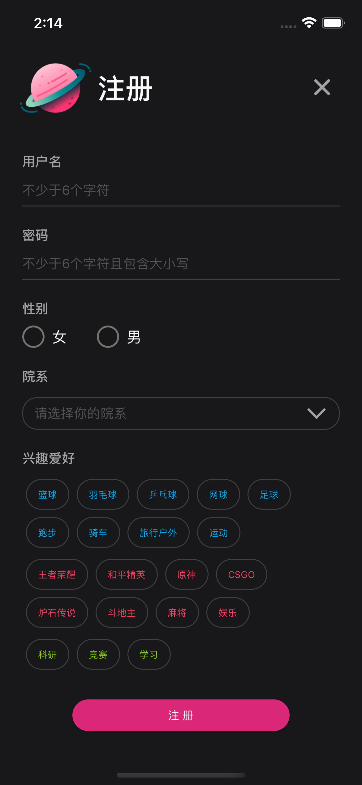
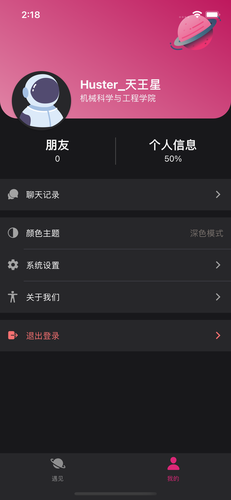
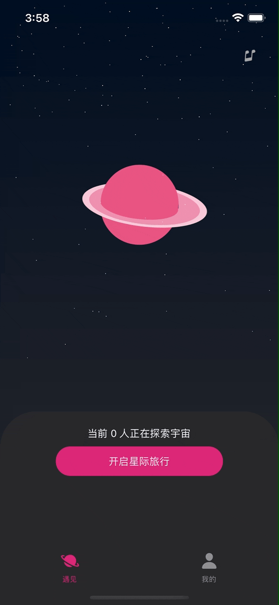

### 

# 
华小遇

一款主打华科校内交友的 APP！同是 Huster，交友对象更靠谱；通过算法匹配对象，保证志趣相投；提供辅助聊天功能，助你轻松破冰，避免尴尬。

## APP 界面

#### 1. 登录 / 注册 / 我的

#### 2. 匹配 / 聊天 / 推荐话题

## 主要依赖

- [**React Native**](https://github.com/facebook/react-native#readme)
- [**Native Base**](https://github.com/GeekyAnts/NativeBase#readme)
- [**Gifted Chat**](https://github.com/FaridSafi/react-native-gifted-chat#readme)

## 接口文档

[**华小遇 API 文档**](https://www.apifox.cn/apidoc/shared-73747cdd-880f-4b68-951f-7294685be27e)

## 编译要求

- Node >= 14

- IOS 端额外：
  - Watchman
  - Xcode
  - CocoaPods
- Android 端额外：
  - JDK >= 11
  - Android Studio 相关（具体可参考[**RN 官网**](https://www.reactnative.cn/docs/environment-setup)）

## 编译步骤

#### 1. 安装项目依赖

`yarn`

#### 2. Android 端

`yarn android`

#### 3. IOS 端

- `cd ios`
- `bundle install`
- `bundle exec pod install`
- `cd ..`
- `yarn ios`
